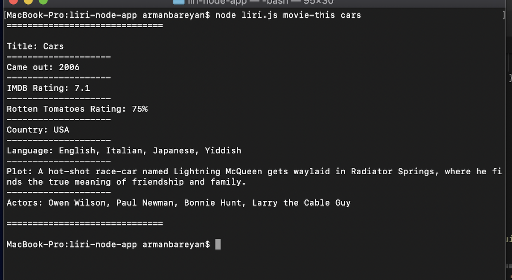
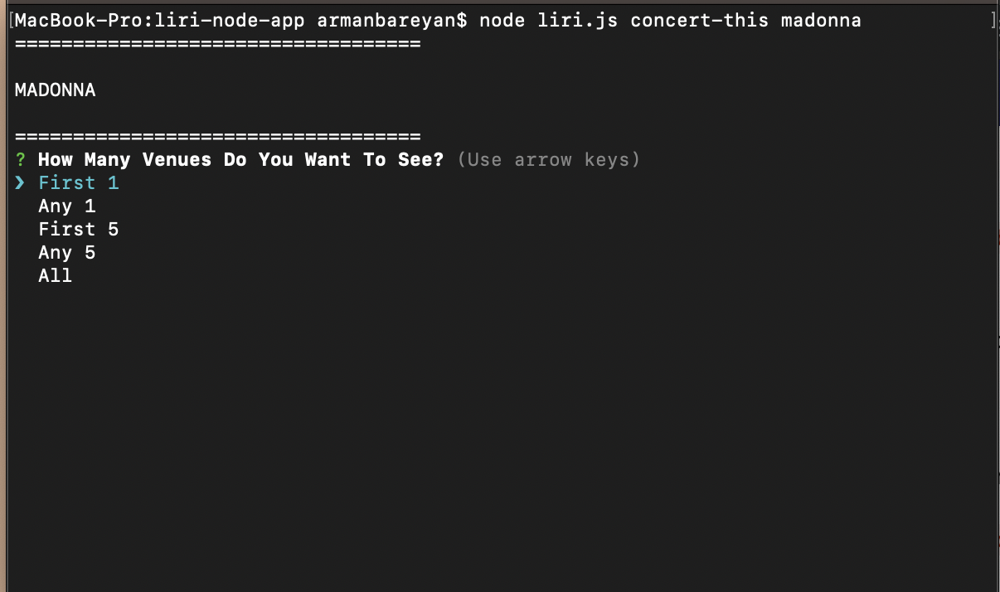
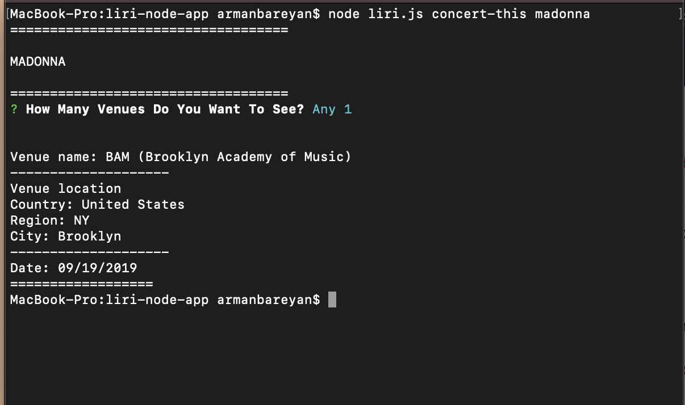
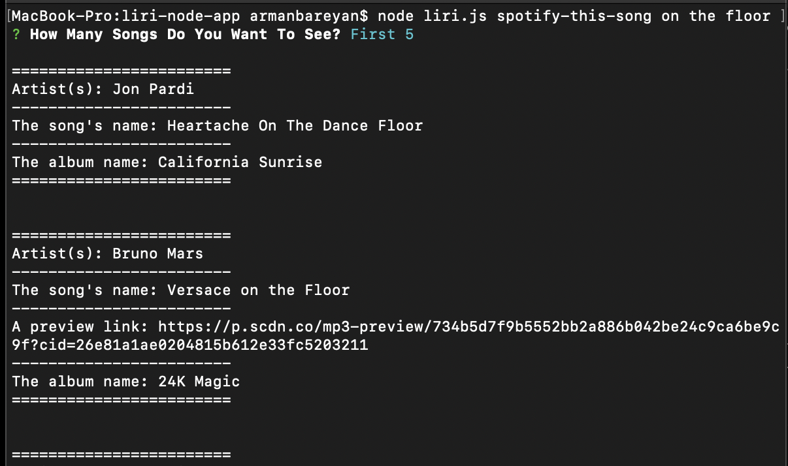

# LIRI-bot

## About LIRI

LIRI is like iPhone's SIRI. However, while SIRI is a Speech Interpretation and Recognition Interface, LIRI is a Language Interpretation and Recognition Interface. LIRI will be a command line node app that takes in parameters and gives you back data.

## How to use LIRI

1. Type in terminal node liri.js movie-this <movie name here> and press enter/return

LIRI's output will be 

* Title of the movie.
* Year the movie came out.
* IMDB Rating of the movie.
* Rotten Tomatoes Rating of the movie.
* Country where the movie was produced.
* Language of the movie.
* Plot of the movie.
* Actors in the movie.

2. Type in terminal node liri.js concert-this <artist/band name here> and press enter/retur
You can choose how many venues do you want to see

* First one
* Any one
* First five
* Any five
* All

LIRI's output will be 

* Name of the venue.
* Venue location.
* Date of the Event (use moment to format this as "MM/DD/YYYY").

3. Type in terminal node liri.js spotify-this-song <song name here> and press enter/retur
You can choose how many songs do you want to see

* First one
* Any one
* First five
* Any five
* All

LIRI's output will be 

* Artist(s).
* The song's name.
* A preview link of the song from Spotify.
* The album that the song is from.

4. Type in terminal node liri.js do-what-it-says and press enter/retur
LIRI's output will be the same as point 3, the song name is "I Want it That Way".
